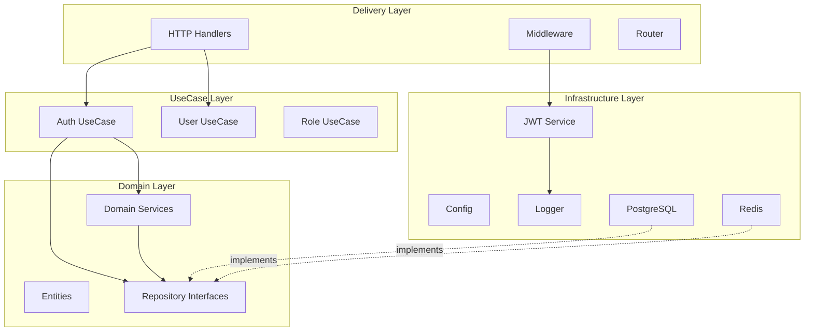

# Design Document: Clean Architecture Refactoring

## Overview

Dokumen ini menjelaskan design untuk refactoring project Authorizer dari struktur yang mencampur dependency injection dengan business logic menjadi clean architecture yang lebih baik, mengikuti pattern dari project Stackforge. Refactoring ini akan meningkatkan separation of concerns, testability, dan maintainability tanpa mengubah fungsionalitas yang ada.

### Goals

1. Menghapus resource layer yang mencampur DI dengan business logic
2. Memindahkan dependency injection ke main.go untuk explicit dependency graph
3. Memisahkan domain service dari infrastructure service
4. Merapikan struktur folder sesuai clean architecture principles
5. Meningkatkan testability dengan better dependency injection
6. Mempertahankan 100% backward compatibility dengan API yang ada

### Non-Goals

1. Mengubah business logic atau algoritma yang ada
2. Mengubah database schema atau migration
3. Mengganti framework (tetap menggunakan Echo)
4. Menambahkan fitur baru
5. Mengubah API contracts (endpoints, request/response format)

## Architecture

### Current Architecture Problems


**Resource Layer Anti-Pattern:**
```
main.go → Server → Resource (DI + Logic) → Handler
                                         → UseCase
                                         → Repository
```

Masalah:
- Resource layer mencampur dependency injection dengan initialization logic
- Dependency graph tidak eksplisit
- Sulit untuk testing karena dependencies tersembunyi di resource layer
- Violates Single Responsibility Principle

**Current Folder Structure:**
```
internal/
├── app/
│   ├── resource/          # ❌ Anti-pattern: DI + Logic
│   ├── handlers.go        # ❌ Routing logic di app layer
│   ├── router.go
│   └── server.go
├── delivery/http/
│   ├── middleware/
│   └── v1/                # Handlers
├── domain/
│   ├── entity/
│   └── repository/        # Interfaces only
├── infrastructure/
│   └── persistence/       # Repository implementations
├── service/               # ❌ Mixed domain + infra services
└── usecase/
```

### Target Architecture


**Clean Dependency Injection:**
```
main.go:
  1. Initialize Infrastructure (config, logger, db, redis)
  2. Initialize Repositories (with db/redis dependencies)
  3. Initialize Services (domain + infrastructure)
  4. Initialize UseCases (with repo + service dependencies)
  5. Initialize Handlers (with usecase dependencies)
  6. Initialize Middleware (with service dependencies)
  7. Setup Router (with handlers + middleware)
  8. Start Server
```

**Target Folder Structure:**
```
cmd/api/
└── main.go                # ✅ All DI happens here

internal/
├── delivery/http/
│   ├── handler/           # ✅ Renamed from v1
│   ├── middleware/
│   └── router/            # ✅ Separated routing logic
├── domain/
│   ├── entity/
│   ├── repository/        # Interfaces
│   └── service/           # ✅ Pure domain services
├── infrastructure/
│   ├── auth/              # ✅ JWT, JWKS infrastructure
│   ├── config/            # ✅ Moved from root
│   ├── logger/            # ✅ New structured logger
│   └── persistence/
│       ├── postgres/
│       └── redis/
└── usecase/
    ├── auth/
    ├── user/
    ├── role/
    ├── permission/
    └── application/
```

### Dependency Rules


1. **Domain Layer** (innermost):
   - No dependencies on other layers
   - Contains: entities, repository interfaces, domain service interfaces
   - Pure business logic

2. **UseCase Layer**:
   - Depends only on Domain layer
   - Orchestrates business workflows
   - Uses repository and domain service interfaces

3. **Infrastructure Layer**:
   - Depends on Domain layer (implements interfaces)
   - Contains: database, cache, auth, config, logger implementations
   - External dependencies isolated here

4. **Delivery Layer**:
   - Depends on Domain and UseCase layers
   - Contains: HTTP handlers, middleware, routing
   - Translates HTTP requests to usecase calls

5. **Main (cmd/api)**:
   - Depends on all layers
   - Wires everything together
   - Only place where concrete types are instantiated

## Components and Interfaces

### 1. Infrastructure Layer Components

#### Config Service


**Location:** `internal/infrastructure/config/config.go`

**Purpose:** Load and manage application configuration

**Interface:**
```go
type Config struct {
    Server struct {
        Port int
    }
    Database struct {
        Host     string
        Port     int
        User     string
        Password string
        DBName   string
    }
    Redis struct {
        Host     string
        Port     int
        Password string
        DB       int
    }
    JWT struct {
        PrivateKey *rsa.PrivateKey
        PublicKey  *rsa.PublicKey
        KeyID      string
    }
}

func Load() (*Config, error)
```

**Migration:** Move from `config/config.go` to `internal/infrastructure/config/config.go`

#### Logger Service

**Location:** `internal/infrastructure/logger/logger.go`

**Purpose:** Structured logging with levels

**Interface:**
```go
type Logger interface {
    Info(msg string, fields ...Field)
    Error(msg string, fields ...Field)
    Debug(msg string, fields ...Field)
    Warn(msg string, fields ...Field)
}

type Field struct {
    Key   string
    Value interface{}
}

func New() Logger
```

#### JWT Infrastructure Service


**Location:** `internal/infrastructure/auth/jwt_service.go`

**Purpose:** JWT token generation and validation (infrastructure concern)

**Interface:**
```go
type JWTService interface {
    GenerateToken(ctx context.Context, claims *entity.Claims, privateKey *rsa.PrivateKey, keyID string) (string, error)
    ValidateToken(ctx context.Context, tokenString string, publicKey *rsa.PublicKey) (*entity.Claims, error)
}

type jwtService struct {
    logger Logger
}

func NewJWTService(logger Logger) JWTService
```

**Changes from Current:**
- Remove repository dependencies from JWT service
- JWT service only handles token mechanics (sign, verify)
- Claims building logic moves to domain service
- Validation logic stays but simplified

#### JWKS Service

**Location:** `internal/infrastructure/auth/jwks_service.go`

**Purpose:** Serve JWKS endpoint for public key distribution

**Interface:**
```go
type JWKSService interface {
    GetJWKS(publicKey *rsa.PublicKey, keyID string) (*JWKSResponse, error)
}

type JWKSResponse struct {
    Keys []JWK `json:"keys"`
}

type JWK struct {
    Kty string `json:"kty"`
    Use string `json:"use"`
    Alg string `json:"alg"`
    Kid string `json:"kid"`
    N   string `json:"n"`
    E   string `json:"e"`
}

func NewJWKSService() JWKSService
```

### 2. Domain Layer Components

#### Domain Service: Auth Service


**Location:** `internal/domain/service/auth_service.go`

**Purpose:** Build JWT claims from user data and authorization rules (business logic)

**Interface:**
```go
type AuthService interface {
    BuildClaims(ctx context.Context, user *entity.User, appCode string) (*entity.Claims, error)
}

type authService struct {
    userRoleRepo repository.UserRoleRepository
    roleRepo     repository.RoleRepository
    rolePermRepo repository.RolePermRepository
    appRepo      repository.AppRepository
}

func NewAuthService(
    userRoleRepo repository.UserRoleRepository,
    roleRepo repository.RoleRepository,
    rolePermRepo repository.RolePermRepository,
    appRepo repository.AppRepository,
) AuthService
```

**Responsibilities:**
- Query user roles from repositories
- Query role permissions from repositories
- Build authorization array for JWT claims
- Determine audiences based on app code
- Pure business logic, no infrastructure concerns

#### Domain Entities

**Location:** `internal/domain/entity/`

**Existing entities remain unchanged:**
- User
- Role
- Permission
- Application
- UserRole
- RolePermission

**New entity for JWT:**
```go
type Claims struct {
    Issuer        string
    Subject       string
    Audience      []string
    ExpiresAt     int64
    IssuedAt      int64
    Username      string
    Email         string
    Authorization []Authorization
}

type Authorization struct {
    App         string
    Roles       []string
    Permissions []string
}
```

### 3. UseCase Layer Components

#### Auth UseCase


**Location:** `internal/usecase/auth/usecase.go`

**Purpose:** Orchestrate authentication workflow

**Interface:**
```go
type UseCase interface {
    Login(ctx context.Context, req *LoginRequest) (*LoginResponse, error)
    Logout(ctx context.Context, userID string) error
    RefreshToken(ctx context.Context, refreshToken string) (*TokenResponse, error)
}

type LoginRequest struct {
    Application string
    Email       string
    Password    string
    ValidToken  string // For token reuse optimization
}

type LoginResponse struct {
    User         *entity.User
    AccessToken  string
    RefreshToken string
    Claims       *entity.Claims
    ExpiresAt    time.Time
}

type authUseCase struct {
    userRepo     repository.UserRepository
    authRepo     repository.AuthRepository
    authService  service.AuthService      // Domain service
    jwtService   infrastructure.JWTService // Infrastructure service
    config       *config.Config
    logger       Logger
}

func NewAuthUseCase(
    userRepo repository.UserRepository,
    authRepo repository.AuthRepository,
    authService service.AuthService,
    jwtService infrastructure.JWTService,
    config *config.Config,
    logger Logger,
) UseCase
```

**Changes from Current:**
- Remove direct repository access for roles/permissions
- Delegate claims building to domain service
- Delegate token generation to infrastructure service
- Add logger for observability
- Remove config dependency from handler (move to usecase)

#### Other UseCases

**User UseCase:** `internal/usecase/user/usecase.go`
**Role UseCase:** `internal/usecase/role/usecase.go`
**Permission UseCase:** `internal/usecase/permission/usecase.go`
**Application UseCase:** `internal/usecase/application/usecase.go`

All follow similar pattern:
- Accept repository interfaces as dependencies
- Accept domain services as dependencies
- Accept logger as dependency
- No infrastructure dependencies except logger and config

### 4. Delivery Layer Components

#### HTTP Handlers


**Location:** `internal/delivery/http/handler/` (renamed from v1)

**Auth Handler:**
```go
type AuthHandler struct {
    authUC      usecase.AuthUseCase
    jwksService infrastructure.JWKSService
    config      *config.Config
    logger      Logger
}

func NewAuthHandler(
    authUC usecase.AuthUseCase,
    jwksService infrastructure.JWKSService,
    config *config.Config,
    logger Logger,
) *AuthHandler

// Methods:
func (h *AuthHandler) Login() echo.HandlerFunc
func (h *AuthHandler) Logout() echo.HandlerFunc
func (h *AuthHandler) GetJWKS() echo.HandlerFunc
```

**Changes:**
- Remove direct config access from handler methods
- Add logger for request logging
- Add JWKS service for JWKS endpoint
- UseCase handles all business logic

**Other Handlers:**
- UserHandler
- RoleHandler
- PermissionHandler
- ApplicationHandler
- HealthHandler

All follow similar pattern:
- Accept usecase interface as dependency
- Accept logger as dependency
- No direct repository or service access
- Only handle HTTP concerns (parsing, validation, response formatting)

#### Middleware

**JWT Auth Middleware:**

**Location:** `internal/delivery/http/middleware/auth.go`

```go
func JWTAuthMiddleware(jwtService infrastructure.JWTService, config *config.Config, logger Logger) echo.MiddlewareFunc {
    return func(next echo.HandlerFunc) echo.HandlerFunc {
        return func(c echo.Context) error {
            // Extract token from header
            // Validate using jwtService
            // Set claims in context
            // Call next handler
        }
    }
}
```

**Changes:**
- Accept JWT service as parameter (no global config)
- Accept logger for middleware logging
- Return middleware function (closure pattern)

**Permission Middleware:**

```go
func RequirePermission(app, perm string) echo.MiddlewareFunc {
    return func(next echo.HandlerFunc) echo.HandlerFunc {
        return func(c echo.Context) error {
            // Get claims from context
            // Check permission
            // Call next or return forbidden
        }
    }
}
```

**No changes needed** - already stateless

#### Router


**Location:** `internal/delivery/http/router/router.go`

**Purpose:** Setup all routes with handlers and middleware

```go
type RouterConfig struct {
    AuthHandler       *handler.AuthHandler
    UserHandler       *handler.UserHandler
    RoleHandler       *handler.RoleHandler
    PermHandler       *handler.PermissionHandler
    AppHandler        *handler.ApplicationHandler
    HealthHandler     *handler.HealthHandler
    JWTMiddleware     echo.MiddlewareFunc
    Logger            Logger
}

func Setup(e *echo.Echo, cfg *RouterConfig) error
```

**Changes:**
- Move routing logic from `internal/app/` to `internal/delivery/http/router/`
- Accept all handlers and middleware as parameters
- No initialization logic, only routing
- Return error for validation

### 5. Main Application

**Location:** `cmd/api/main.go`

**Purpose:** Wire all dependencies and start server

**Structure:**
```go
func main() {
    // 1. Load configuration
    cfg := loadConfig()
    
    // 2. Initialize infrastructure
    logger := initLogger()
    db := initDatabase(cfg, logger)
    redis := initRedis(cfg, logger)
    
    // 3. Initialize repositories
    repos := initRepositories(db, redis)
    
    // 4. Initialize services
    services := initServices(repos, logger)
    
    // 5. Initialize use cases
    usecases := initUseCases(repos, services, cfg, logger)
    
    // 6. Initialize handlers
    handlers := initHandlers(usecases, services, cfg, logger)
    
    // 7. Initialize middleware
    middleware := initMiddleware(services, cfg, logger)
    
    // 8. Setup router
    e := echo.New()
    router.Setup(e, &router.RouterConfig{
        AuthHandler:   handlers.Auth,
        UserHandler:   handlers.User,
        // ... other handlers
        JWTMiddleware: middleware.JWT,
        Logger:        logger,
    })
    
    // 9. Start server with graceful shutdown
    startServer(e, cfg, logger)
}
```

## Data Models

### Existing Models (No Changes)

All existing domain entities remain unchanged:


- `entity.User`
- `entity.Role`
- `entity.Permission`
- `entity.Application`
- `entity.UserRole`
- `entity.RolePermission`

### New Models

**JWT Claims Entity:**

```go
// internal/domain/entity/claims.go
package entity

type Claims struct {
    Issuer        string          `json:"iss"`
    Subject       string          `json:"sub"`
    Audience      []string        `json:"aud"`
    ExpiresAt     int64           `json:"exp"`
    IssuedAt      int64           `json:"iat"`
    Username      string          `json:"username"`
    Email         string          `json:"email"`
    Authorization []Authorization `json:"authorization"`
}

type Authorization struct {
    App         string   `json:"app"`
    Roles       []string `json:"roles"`
    Permissions []string `json:"permissions"`
}
```

**Migration:** Move from `middleware.JWTClaims` to `entity.Claims`

### Repository Interfaces (No Changes)

All repository interfaces in `internal/domain/repository/` remain unchanged:
- AuthRepository
- UserRepository
- RoleRepository
- PermissionRepository
- ApplicationRepository
- UserRoleRepository
- RolePermissionRepository

## Correctness Properties


A property is a characteristic or behavior that should hold true across all valid executions of a system—essentially, a formal statement about what the system should do. Properties serve as the bridge between human-readable specifications and machine-verifiable correctness guarantees.

### Behavioral Properties

These properties ensure the refactoring maintains 100% backward compatibility with existing behavior.

**Property 1: Complete API Backward Compatibility**

*For any* valid HTTP request to any endpoint, the response (including status code, headers, body structure, and content) after refactoring SHALL be identical to the response before refactoring.

**Validates: Requirements 6.1, 6.2, 9.1, 9.2, 9.3, 9.4, 9.5**

**Property 2: Authentication and Authorization Preservation**

*For any* user with a specific set of roles and permissions, access to endpoints (allowed/denied) and the authorization logic SHALL be identical before and after refactoring.

**Validates: Requirements 6.3**

**Property 3: Redis Caching Behavior Preservation**

*For any* cacheable operation, the cache hit/miss behavior and cached data SHALL be identical before and after refactoring.

**Validates: Requirements 6.5**

### Structural Properties

These properties ensure the refactored code follows clean architecture principles.

**Property 4: Layer Dependency Rule Compliance**

*For any* file in the domain layer, it SHALL NOT import packages from infrastructure, delivery, or usecase layers. *For any* file in the usecase layer, it SHALL NOT import packages from infrastructure or delivery layers.

**Validates: Requirements 4.4, 4.5**

**Property 5: Dependency Injection Pattern Compliance**

*For any* struct type that has dependencies, it SHALL have a constructor function that accepts all dependencies as parameters, and all external dependencies SHALL be referenced through interfaces rather than concrete types.

**Validates: Requirements 5.1, 5.2, 5.3**

**Property 6: Handler Structure Compliance**

*For any* HTTP handler, it SHALL NOT import the resource package, SHALL accept usecase interfaces in its constructor, and SHALL NOT have direct access to repository or infrastructure service types.

**Validates: Requirements 7.2, 7.3, 7.4**

**Property 7: Middleware Dependency Injection Compliance**

*For any* middleware function, it SHALL accept its dependencies (services, config, logger) as parameters through closure or constructor pattern, and SHALL NOT use global state or singleton patterns.

**Validates: Requirements 8.1, 8.2, 8.3, 8.4**

### Example-Based Verification

These are specific checks that verify structural requirements.

**Example 1: No Resource Package Imports**

Verify that no Go file in the codebase imports `internal/app/resource` package.

**Validates: Requirements 1.4**

**Example 2: No Circular Dependencies**

Verify that the Go module has no circular import dependencies (Go compiler enforces this, but we verify explicitly).

**Validates: Requirements 2.6**

**Example 3: Folder Structure Exists**

Verify that the directory structure includes: `internal/domain/`, `internal/usecase/`, `internal/infrastructure/`, `internal/delivery/`.

**Validates: Requirements 4.3**

**Example 4: Test Coverage Per Layer**

Verify that at least one test file exists for each layer (domain, usecase, infrastructure, delivery).

**Validates: Requirements 5.5**

**Example 5: Existing Integration Tests Pass**

Verify that all existing integration tests pass without modification after refactoring.

**Validates: Requirements 6.6**

**Example 6: Documentation Exists**

Verify that README.md, architecture diagram, and testing documentation exist and are updated.

**Validates: Requirements 10.1, 10.2, 10.3, 10.4, 10.5**

## Error Handling


### Error Handling Strategy

**Principle:** Error handling remains unchanged during refactoring. All existing error types, messages, and HTTP status codes are preserved.

### Error Flow

```
Handler → UseCase → Repository/Service
   ↓         ↓            ↓
Error    Error        Error
   ↓         ↓            ↓
HTTP     Wrap         Return
Response  Error        Error
```

### Error Types (Preserved)

1. **Validation Errors:** 400 Bad Request
   - Invalid input format
   - Missing required fields
   - Invalid email/password format

2. **Authentication Errors:** 401 Unauthorized
   - Missing token
   - Invalid token
   - Expired token
   - Invalid credentials

3. **Authorization Errors:** 403 Forbidden
   - Missing required permission
   - Missing required role

4. **Not Found Errors:** 404 Not Found
   - User not found
   - Role not found
   - Application not found

5. **Conflict Errors:** 409 Conflict
   - Duplicate email
   - Duplicate role code
   - Duplicate application code

6. **Internal Errors:** 500 Internal Server Error
   - Database errors
   - Redis errors
   - Unexpected errors

### Error Response Format (Preserved)

```json
{
  "status": "error",
  "code": 400,
  "error": "BadRequest",
  "message": "email cannot be empty"
}
```

### Logging Strategy

**New Addition:** Structured logging with context

```go
logger.Error("failed to authenticate user",
    logger.Field{Key: "email", Value: email},
    logger.Field{Key: "error", Value: err.Error()},
)
```

**Log Levels:**
- **DEBUG:** Detailed flow information (development only)
- **INFO:** Important business events (login, logout, role assignment)
- **WARN:** Recoverable errors (invalid token, permission denied)
- **ERROR:** Unrecoverable errors (database connection, Redis failure)

## Testing Strategy


### Testing Approach

This refactoring requires a comprehensive testing strategy to ensure no regressions. We use a combination of:

1. **Existing Integration Tests:** Must pass without modification (Example 5)
2. **Property-Based Tests:** Verify behavioral properties (Properties 1-3)
3. **Structural Tests:** Verify architecture compliance (Properties 4-7, Examples 1-4, 6)
4. **Unit Tests:** Test individual components in isolation

### Test Pyramid

```
        /\
       /  \      E2E Tests (Existing integration tests)
      /____\
     /      \    Property-Based Tests (Behavioral properties)
    /________\
   /          \  Structural Tests (Architecture compliance)
  /____________\
 /              \ Unit Tests (Component isolation)
```

### Property-Based Testing

**Library:** Use `gopter` (Go property testing library)

**Configuration:**
- Minimum 100 iterations per property test
- Each test tagged with: `Feature: clean-architecture-refactoring, Property N: [property text]`

**Property 1 Test Strategy:**

```go
// Test: API Backward Compatibility
// For each endpoint, generate random valid requests
// Compare responses before and after refactoring
// Verify: status code, headers, body structure identical

func TestProperty1_APIBackwardCompatibility(t *testing.T) {
    properties := gopter.NewProperties(nil)
    
    properties.Property("API responses identical before and after refactoring",
        prop.ForAll(
            func(endpoint Endpoint, request Request) bool {
                // Call old implementation
                oldResponse := callOldAPI(endpoint, request)
                
                // Call new implementation
                newResponse := callNewAPI(endpoint, request)
                
                // Compare responses
                return responseEqual(oldResponse, newResponse)
            },
            genEndpoint(),
            genValidRequest(),
        ))
    
    properties.TestingRun(t, gopter.ConsoleReporter(false))
}
```

**Property 2 Test Strategy:**

```go
// Test: Authentication and Authorization Preservation
// For each user with specific roles/permissions
// Verify access to endpoints identical before and after

func TestProperty2_AuthPreservation(t *testing.T) {
    properties := gopter.NewProperties(nil)
    
    properties.Property("Auth behavior identical before and after refactoring",
        prop.ForAll(
            func(user User, endpoint Endpoint) bool {
                oldAccess := checkOldAccess(user, endpoint)
                newAccess := checkNewAccess(user, endpoint)
                return oldAccess == newAccess
            },
            genUser(),
            genEndpoint(),
        ))
    
    properties.TestingRun(t, gopter.ConsoleReporter(false))
}
```

**Property 3 Test Strategy:**

```go
// Test: Redis Caching Behavior Preservation
// For cacheable operations, verify cache behavior identical

func TestProperty3_CachingPreservation(t *testing.T) {
    properties := gopter.NewProperties(nil)
    
    properties.Property("Cache behavior identical before and after refactoring",
        prop.ForAll(
            func(operation CacheableOp) bool {
                // Clear cache
                clearCache()
                
                // Execute with old implementation
                oldResult1 := executeOld(operation)
                oldResult2 := executeOld(operation) // Should hit cache
                
                // Clear cache
                clearCache()
                
                // Execute with new implementation
                newResult1 := executeNew(operation)
                newResult2 := executeNew(operation) // Should hit cache
                
                // Verify cache hit behavior identical
                return oldResult1 == newResult1 && oldResult2 == newResult2
            },
            genCacheableOperation(),
        ))
    
    properties.TestingRun(t, gopter.ConsoleReporter(false))
}
```

### Structural Testing

**Property 4-7 Test Strategy:**

Use static analysis to verify architecture compliance:

```go
// Test: Layer Dependency Rule Compliance
func TestProperty4_LayerDependencies(t *testing.T) {
    // Parse all Go files
    // Build import graph
    // Verify domain layer doesn't import infra/delivery/usecase
    // Verify usecase layer doesn't import infra/delivery
}

// Test: Dependency Injection Pattern Compliance
func TestProperty5_DependencyInjection(t *testing.T) {
    // Parse all struct types
    // Verify each has constructor function
    // Verify dependencies are interfaces
}

// Test: Handler Structure Compliance
func TestProperty6_HandlerStructure(t *testing.T) {
    // Parse all handler files
    // Verify no resource package imports
    // Verify constructors accept usecase interfaces
    // Verify no repository/service fields
}

// Test: Middleware Dependency Injection Compliance
func TestProperty7_MiddlewareStructure(t *testing.T) {
    // Parse all middleware files
    // Verify no global variables
    // Verify dependencies passed as parameters
}
```

### Unit Testing

**Per Layer Testing:**

1. **Domain Service Tests:**
```go
func TestAuthService_BuildClaims(t *testing.T) {
    // Mock repositories
    mockUserRoleRepo := &MockUserRoleRepository{}
    mockRoleRepo := &MockRoleRepository{}
    // ... setup mocks
    
    authService := service.NewAuthService(
        mockUserRoleRepo,
        mockRoleRepo,
        mockRolePermRepo,
        mockAppRepo,
    )
    
    // Test claims building logic
    claims, err := authService.BuildClaims(ctx, user, "APP1")
    
    // Verify claims structure
    assert.NoError(t, err)
    assert.Equal(t, user.Email, claims.Email)
    // ... more assertions
}
```

2. **UseCase Tests:**
```go
func TestAuthUseCase_Login(t *testing.T) {
    // Mock all dependencies
    mockUserRepo := &MockUserRepository{}
    mockAuthRepo := &MockAuthRepository{}
    mockAuthService := &MockAuthService{}
    mockJWTService := &MockJWTService{}
    
    authUC := usecase.NewAuthUseCase(
        mockUserRepo,
        mockAuthRepo,
        mockAuthService,
        mockJWTService,
        cfg,
        logger,
    )
    
    // Test login flow
    result, err := authUC.Login(ctx, &LoginRequest{
        Email: "test@example.com",
        Password: "password123",
    })
    
    // Verify result
    assert.NoError(t, err)
    assert.NotEmpty(t, result.AccessToken)
}
```

3. **Handler Tests:**
```go
func TestAuthHandler_Login(t *testing.T) {
    // Mock usecase
    mockAuthUC := &MockAuthUseCase{}
    
    handler := handler.NewAuthHandler(
        mockAuthUC,
        mockJWKSService,
        cfg,
        logger,
    )
    
    // Create test request
    req := httptest.NewRequest(http.MethodPost, "/auth/login", body)
    rec := httptest.NewRecorder()
    c := e.NewContext(req, rec)
    
    // Test handler
    err := handler.Login()(c)
    
    // Verify response
    assert.NoError(t, err)
    assert.Equal(t, http.StatusOK, rec.Code)
}
```

4. **Infrastructure Tests:**
```go
func TestJWTService_GenerateToken(t *testing.T) {
    logger := logger.New()
    jwtService := auth.NewJWTService(logger)
    
    // Test token generation
    token, err := jwtService.GenerateToken(ctx, claims, privateKey, keyID)
    
    // Verify token
    assert.NoError(t, err)
    assert.NotEmpty(t, token)
    
    // Verify token can be validated
    parsedClaims, err := jwtService.ValidateToken(ctx, token, publicKey)
    assert.NoError(t, err)
    assert.Equal(t, claims.Email, parsedClaims.Email)
}
```

### Test Execution Order

1. **Phase 1: Structural Tests**
   - Run before refactoring to establish baseline
   - Run after each refactoring step to verify compliance

2. **Phase 2: Unit Tests**
   - Write tests for new components as they're created
   - Ensure each component works in isolation

3. **Phase 3: Property-Based Tests**
   - Run after major refactoring milestones
   - Verify behavioral properties maintained

4. **Phase 4: Integration Tests**
   - Run existing integration test suite
   - Must pass without modification

### Continuous Verification

During refactoring, after each significant change:
1. Run structural tests (fast, catches architecture violations)
2. Run unit tests for affected components
3. Run full test suite before committing

### Test Coverage Goals

- **Unit Test Coverage:** Minimum 80% per layer
- **Integration Test Coverage:** All critical paths (existing tests)
- **Property Test Coverage:** All behavioral properties (Properties 1-3)
- **Structural Test Coverage:** All architecture rules (Properties 4-7)

## Migration Strategy


### Refactoring Approach

**Strategy:** Incremental refactoring with continuous verification

**Principle:** Each step should leave the codebase in a working state

### Phase 1: Setup Infrastructure

**Goal:** Create new infrastructure components without breaking existing code

**Steps:**
1. Create `internal/infrastructure/config/` and copy config code
2. Create `internal/infrastructure/logger/` with new logger
3. Create `internal/infrastructure/auth/` for JWT infrastructure
4. Keep old code working alongside new code

**Verification:** Existing tests still pass

### Phase 2: Create Domain Services

**Goal:** Extract pure business logic into domain services

**Steps:**
1. Create `internal/domain/service/` directory
2. Create `auth_service.go` with claims building logic
3. Extract claims building from JWT service to auth service
4. Keep both implementations working

**Verification:** Unit tests for new domain service pass

### Phase 3: Refactor UseCases

**Goal:** Update usecases to use new domain services

**Steps:**
1. Update auth usecase to accept domain auth service
2. Update auth usecase to accept infrastructure JWT service
3. Update other usecases similarly
4. Keep resource layer working for now

**Verification:** Usecase tests pass with new dependencies

### Phase 4: Refactor Handlers

**Goal:** Update handlers to remove resource layer dependency

**Steps:**
1. Rename `internal/delivery/http/v1/` to `internal/delivery/http/handler/`
2. Update handler constructors to accept usecases directly
3. Update handler imports
4. Keep resource layer for backward compatibility

**Verification:** Handler tests pass with new structure

### Phase 5: Refactor Middleware

**Goal:** Update middleware to accept dependencies explicitly

**Steps:**
1. Update JWT middleware to accept JWT service as parameter
2. Update permission middleware if needed
3. Return middleware functions (closure pattern)

**Verification:** Middleware tests pass

### Phase 6: Create Router

**Goal:** Separate routing logic from app layer

**Steps:**
1. Create `internal/delivery/http/router/` directory
2. Move routing logic from `internal/app/` to router
3. Create `RouterConfig` struct for dependencies
4. Implement `Setup()` function

**Verification:** Routing tests pass

### Phase 7: Refactor Main.go

**Goal:** Move all dependency injection to main.go

**Steps:**
1. Update `cmd/api/main.go` with new DI structure
2. Initialize infrastructure components
3. Initialize repositories
4. Initialize services (domain + infrastructure)
5. Initialize usecases
6. Initialize handlers
7. Initialize middleware
8. Setup router
9. Start server

**Verification:** Application starts and all endpoints work

### Phase 8: Remove Resource Layer

**Goal:** Delete resource layer completely

**Steps:**
1. Verify no imports to `internal/app/resource/`
2. Delete `internal/app/resource/` directory
3. Delete `internal/app/handlers.go`
4. Delete `internal/app/router.go`
5. Keep only `internal/app/server.go` if needed, or move to main

**Verification:** Application compiles and runs

### Phase 9: Cleanup and Verification

**Goal:** Final cleanup and comprehensive testing

**Steps:**
1. Run all structural tests (Properties 4-7)
2. Run all unit tests
3. Run all property-based tests (Properties 1-3)
4. Run all integration tests (Example 5)
5. Update documentation (Example 6)
6. Create architecture diagram

**Verification:** All tests pass, documentation complete

### Rollback Strategy

**At each phase:**
- Commit working code to version control
- Tag commits with phase number
- If issues arise, rollback to previous phase
- Fix issues before proceeding

**Safety Checks:**
- Never delete code until new code is verified working
- Keep old and new implementations side-by-side during transition
- Use feature flags if needed for gradual rollout

### Risk Mitigation

**Risk 1: Breaking existing functionality**
- Mitigation: Run integration tests after each phase
- Mitigation: Use property-based tests to verify behavior preservation

**Risk 2: Circular dependencies**
- Mitigation: Run structural tests frequently
- Mitigation: Follow dependency rules strictly

**Risk 3: Performance regression**
- Mitigation: Run performance benchmarks before and after
- Mitigation: Profile critical paths

**Risk 4: Incomplete refactoring**
- Mitigation: Use structural tests to verify all components refactored
- Mitigation: Checklist for each component type

## Deployment Considerations

### Zero-Downtime Deployment

**Strategy:** This is a refactoring, not a feature change

**Deployment:**
1. Deploy refactored code to staging environment
2. Run full test suite in staging
3. Run load tests to verify performance
4. Deploy to production using blue-green deployment
5. Monitor error rates and performance metrics
6. Rollback if issues detected

### Monitoring

**Key Metrics:**
- Request latency (should be unchanged)
- Error rates (should be unchanged)
- Database query performance (should be unchanged)
- Redis cache hit rate (should be unchanged)
- Memory usage (may improve with better DI)
- CPU usage (should be unchanged)

### Rollback Plan

**If issues detected in production:**
1. Immediately rollback to previous version
2. Investigate issues in staging
3. Fix issues
4. Re-deploy after verification

## Documentation Updates

### README.md Updates

**Add sections:**
1. **Architecture Overview:** Explain clean architecture layers
2. **Project Structure:** Document new folder structure
3. **Dependency Injection:** Explain DI pattern used
4. **Adding New Features:** Step-by-step guide
5. **Testing:** How to run tests

### Architecture Diagram

**Create Mermaid diagram:**



### Code Examples

**Example: Adding a new feature**

```go
// 1. Define entity in domain/entity/
type NewEntity struct {
    ID   string
    Name string
}

// 2. Define repository interface in domain/repository/
type NewRepository interface {
    Create(ctx context.Context, entity *NewEntity) error
    GetByID(ctx context.Context, id string) (*NewEntity, error)
}

// 3. Implement repository in infrastructure/persistence/
type newRepositoryPGX struct {
    db *pgxpool.Pool
}

func NewNewRepositoryPGX(db *pgxpool.Pool) repository.NewRepository {
    return &newRepositoryPGX{db: db}
}

// 4. Create usecase in usecase/new/
type UseCase interface {
    Create(ctx context.Context, req *CreateRequest) (*CreateResponse, error)
}

type newUseCase struct {
    repo   repository.NewRepository
    logger Logger
}

func NewUseCase(repo repository.NewRepository, logger Logger) UseCase {
    return &newUseCase{repo: repo, logger: logger}
}

// 5. Create handler in delivery/http/handler/
type NewHandler struct {
    uc     usecase.NewUseCase
    logger Logger
}

func NewNewHandler(uc usecase.NewUseCase, logger Logger) *NewHandler {
    return &NewHandler{uc: uc, logger: logger}
}

// 6. Wire in main.go
func main() {
    // ... infrastructure setup
    
    // Repository
    newRepo := postgres.NewNewRepositoryPGX(db)
    
    // UseCase
    newUC := usecase.NewUseCase(newRepo, logger)
    
    // Handler
    newHandler := handler.NewNewHandler(newUC, logger)
    
    // Router
    router.Setup(e, &router.RouterConfig{
        // ... other handlers
        NewHandler: newHandler,
    })
}
```

## Conclusion

This refactoring transforms the Authorizer codebase from a structure with mixed concerns to a clean architecture with clear separation of responsibilities. The key improvements are:

1. **Explicit Dependency Graph:** All dependencies wired in main.go
2. **Better Testability:** Each layer can be tested independently with mocks
3. **Clear Boundaries:** Domain, UseCase, Infrastructure, and Delivery layers well-defined
4. **Maintainability:** Easy to understand and modify code
5. **Extensibility:** Simple pattern for adding new features

The refactoring maintains 100% backward compatibility with existing APIs while improving code quality and architecture. All existing tests pass without modification, and new tests verify architectural compliance.

